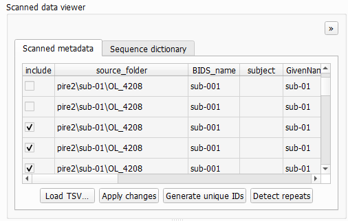

# Converter tab

The initial tab in BIDS-Manager is the `converter tab`, which has 2 main functions: `scan` and `conversion`.


* `scan`: with the scan function you can load your raw data so BIDS-Manager can identify the different structure patterns that can be transformed into BIDS compliant.

```{admonition} Visual theme
:class: tip

Click the left-corner icon of the GUI to open a dropdown list with all available visual themes. This list also includes themes with high-contrast options. This will only affect the visual display of the GUI.

Also, all windows size are adjustable by clicking and dragging from the edges.

```

## Configuration


To scan your dataset, first you need to fullfill the `Configuration` window:
- **Raw data Dir:** Here you can `paste` the path or `browse` your datasets folder. BIDS-Manager can work simulatenusly with raw data from different studies at the same time.
- **BIDS Out Dir:** As above, you can `paste` the path or `browse` to select the folder where you want to keep the converted output, the BIDS-compliant result. 
- **TSV Name:** Everytime you scan your dataset, you create a .tsv file with a summary of your scanned files and the conversion settings. You can edit the name, but the default is _"subject_summary.tsv"_.

Once you have defined the different Configuration parameters, you can press in `Scan files`. Both the terminal and the `Log Output` window will show some updates in the process of scanning your dataset and the creation of the TSV file.

## Scanned Data Viewer



Here you can see a "map" of your uploaded raw data. Here you can choose which files will be included of your dataset, including file modality and it's bids counterpart.
You may also use the `Load TSV...` function which allows you to reload a dataset just by uploading their _"subject_summary.tsv"_, conseving your files selection and overall faster.

## Filter


The filter window is also subdivided in several sections.

* General view: It shows some of the patterns found in all subjects, such as types of images. This usually means that a run ended undexpectedly. This will be included in the final BIDS version as run-1 and run-2. For example, types of images:
  *  T1 and T2: anatomical
  *  dw: difusion
  *  fmap: field maps
  *  func: functional
  *  bold...
*  You can check the ones you want to include in the BIDS compliant version.
*  If you see a `rep 2` next to a name, it means that it's a repetition of another file.

* Specific view:
It's pretty similar to General view, but you can go subject by subject.

* Edit naming: You can see the Given Name and the BIDS name (such as the codeword used during participant recruiting) that will come out. You may check this section to be sure that participants are not mixed together. You may also keep the given name or another nickname, but take into account that won't be BIDS compliant.

 

