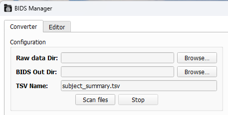
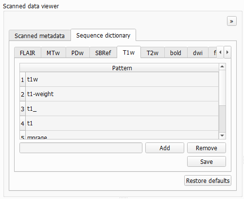
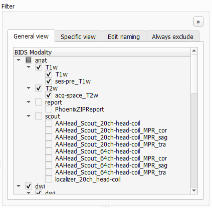

# Converter Tab

The first tab you'll see in BIDS-Manager is the `converter tab. This is where you can `scan` your raw data, identify different patterns and run the `conversion` into a BIDS compliant dataset.


```{admonition} Visual theme
:class: tip

* You can change the color palette with the icon int the lower-left corner icon. The selected theme will onlyy affect the GUI's appearance and will be saved for future sessions. THigh-contrast themes are also available.
* Each sub-section can be resized by and dragging its edges.
* Each sub-section can be undocked by clicking on the `>>` icon (top-right corner). Closing the undocked window will dock it back.
* The `DPI` (dots per inch) setting in the lower-left corner lets you scale the display to match your PC's resolution. Very high DPI values might give issues, not recommended to be set 50% higher than your PC's resolution.

```

## Configuration



To scan your dataset, first you need to fullfill the `Configuration` window:
- **Raw data Dir:** You can paste the path or `browse` to select your datasets folder. BIDS-Manager can work simulatenusly with raw data from different studies at the same time.
- **BIDS Out Dir:** You can `paste` the path or `browse` to select the folder where you want to keep the converted output, the BIDS-compliant result. 
- **TSV Name:** Everytime you scan your dataset, you create a .tsv file with a summary of your scanned files and the conversion settings. You can edit the name, but the default is _"subject_summary.tsv"_.

Once you have defined the different configuration parameters, you can press in `Scan files`.

Both the terminal and the `Log Output` window will show some updates in the process of scanning your dataset and the creation of the TSV file.

## Scanned Data Viewer

### Scanned metadata


Here you can see a the **mapping table** of your uploaded raw data, including subjects, sessions, sequence types and their BIDS proposed conversion.
* `Load TSV...`: lets you reload a dataset by browisng their _"subject_summary.tsv"_. This skips the scanning process, which can take a lot of time. You still need to set the **Raw data Dir** and the **BIDS Out Dir**.
* `Apply changes`: saves and updates in the TSV file with any edits you've made.
* `Generate unique IDs`: if the experimenter forgot to change the IDs in-between recordings, BIDS-Manager will be able to identify the different subjects and assign unique identifiers.
* `Detect repeats`: the `rep` column will show a **2**, which means that this entry is the latest version (common when a run is interrupted and restarted).

### Sequence dictionary



Each tab corresponds to a **BIDS sequence type** and lists the keywords that BIDS-Manager uses to recognize it.
* You can use the `Add` and `Remove` buttons to edit these keywords and include any specific naming patterns you use in your own datasets.
* All changes will be saved for following sessions. The changes are stored in a tsv file within the environment of your BIDS-Manager.
```bash
path/to/BIDS_MANAGER\env\Lib\site-packages\bids_manager\user_preferences

```
* If want to undo modifications or fix mistakes, use the `Restore defaults` option to return to the original keyword list.
 


## Filter



The filter window is also subdivided in several sections.

* General view: It shows some of the patterns found in all subjects, such as types of images. This usually means that a run ended undexpectedly. This will be included in the final BIDS version as run-1 and run-2. For example, types of images:
  *  T1 and T2: anatomical
  *  dw: difusion
  *  fmap: field maps
  *  func: functional
  *  bold...
*  You can check the ones you want to include in the BIDS compliant version.
*  If you see a `rep 2` next to a name, it means that it's a repetition of another file.

* Specific view:
It's pretty similar to General view, but you can go subject by subject.

* Edit naming: You can see the Given Name and the BIDS name (such as the codeword used during participant recruiting) that will come out. You may check this section to be sure that participants are not mixed together. You may also keep the given name or another nickname, but take into account that won't be BIDS compliant.

 

