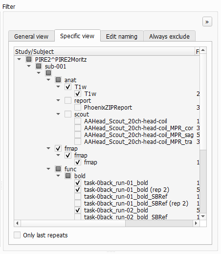

# Converter Tab

The first tab you'll see in BIDS-Manager is the `converter tab`. This is where you can `scan` your raw data, identify different patterns and run the `conversion` into a BIDS compliant dataset.


```{admonition} Visual theme
:class: tip

* You can change the color palette with the icon int the lower-left corner icon. The selected theme will onlyy affect the GUI's appearance and will be saved for future sessions. THigh-contrast themes are also available.
* Each sub-section can be resized by and dragging its edges.
* Each sub-section can be undocked by clicking on the `>>` icon (top-right corner). Closing the undocked window will dock it back.
* The `DPI` (dots per inch) setting in the lower-left corner lets you scale the display to match your PC's resolution. Very high DPI values might give issues, not recommended to be set 50% higher than your PC's resolution.

```

## Configuration

To scan your dataset, first you need to fullfill the `Configuration` window:
- **Raw data Dir:** You can paste the path or `browse` to select your datasets folder. BIDS-Manager can work simulatenusly with raw data from different studies at the same time.
- **BIDS Out Dir:** You can `paste` the path or `browse` to select the folder where you want to keep the converted output, the BIDS-compliant result. 
- **TSV Name:** Everytime you scan your dataset, you create a .tsv file with a summary of your scanned files and the conversion settings. You can edit the name, but the default is _"subject_summary.tsv"_.

Once you have defined the different configuration parameters, you can press in `Scan files`.

Both the terminal and the `Log Output` window will show some updates in the process of scanning your dataset and the creation of the TSV file.

## Scanned Data Viewer

### Scanned metadata

Here you can see a the **mapping table** of your uploaded raw data, including subjects, sessions, sequence types and their BIDS proposed conversion.
* `Load TSV...`: lets you reload a dataset by browisng their _"subject_summary.tsv"_. This skips the scanning process, which can take a lot of time. You still need to set the **Raw data Dir** and the **BIDS Out Dir**.
* `Apply changes`: saves and updates in the TSV file with any edits you've made.
* `Generate unique IDs`: if the experimenter forgot to change the IDs in-between recordings, BIDS-Manager will be able to identify the different subjects and assign unique identifiers.
* `Detect repeats`: the `rep` column will show a **2**, which means that this entry is the latest version (common when a run is interrupted and restarted).

### Sequence dictionary

Each tab corresponds to a **BIDS sequence type** and lists the keywords that BIDS-Manager uses to recognize it.
* You can use the `Add` and `Remove` buttons to edit these keywords and include any specific naming patterns you use in your own datasets.
* All changes will be saved for following sessions. The changes are stored in a tsv file within the environment of your BIDS-Manager.

```bash
path/to/BIDS_MANAGER\env\Lib\site-packages\bids_manager\user_preferences
```

* If you want to undo modifications or fix mistakes, use the `Restore defaults` option to return to the original keyword list.
 
## Filter

### General View


It displays all of the patterns detected in all subjects, organized and classified by **BIDS sequence types** (anat, func, fmap, dwi..). Under each modality you'll see the specific types of images and runs that were detected during scanning.
* You can check and uncheck which ones you want to include in the final BIDS converted dataset.
* If a sequences shows (rep2) next to its name, it means that it's a duplicated. They will be included as run-1 and run-2.

### Specific view

This view is similar to the General view, but you here can select *specific files per subject*.
The option `Only last repeats` automatically keeps the most recent version of each duplicateand deselect the older ones. Be aware, this might overwrite some changes done in the General view.

### Edit naming

This pannels displays both the **BIDS name** and the **Given Name** (e.g. the codeword used during participant recruiting). Use this section to verify that participants are not misassigned. You can also manually modify the BIDS name or the given name if correction are needed.
The dropdown below lets you choose between `Use BIDS name` or `Use given name`, but note that selecting the Given Name option won't be BIDS compliant.

 ### Always exclude

BIDS-Manager has a list of common scan patterns that are usually not necesary and exclude them automatically during scanning. You can add new **patterns manually** so they won't be scan in your next session.
All new patterns will be stored in a tsv file within your BIDS-Manager environment:

```bash
path/to/BIDS_MANAGER\env\Lib\site-packages\bids_manager\user_preferences
```


 ## Preview


