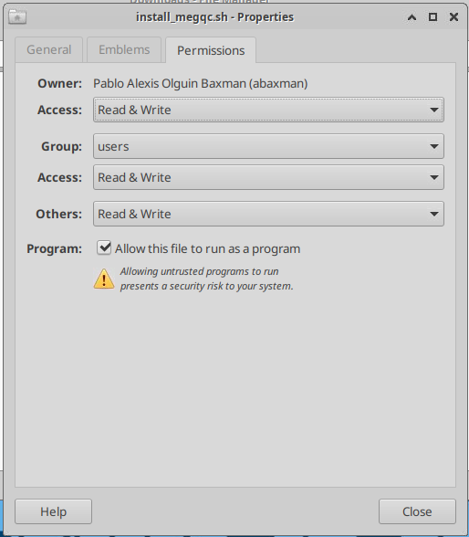

# Installation Guide
You can install BIDS-Manager in two different ways:

## One-click installers (recommended)

**1. Download the ZIP package:**  
* **[📦 One-click Installers](https://github.com/ANCPLabOldenburg/BIDS-Manager/raw/main/Installers/Installers.zip
)**

**2. **Extract** the ZIP file and run the script:**

| OS               | Script                        | How to Run                         | Duration |
|------------------|-------------------------------|------------------------------------|---------|
| **Windows 10/11**| `install_bids_manager.bat`     | Double-click                        | ≈ 5 min |
| **Linux**        | `install_bids_manager.sh`      | Allow execution and run the installer | ≈ 5 min |


**3. Allow script execution (for Linux users):**

If you're working in Linux, you'll need first to allow the `.sh` script execution. This can be done in two different ways:

````{tab-set}
```{tab-item} Option 1
Right click and select **"Open terminal here"** or open a terminal and use:

    cd /path/to/your/installer

Allow "execute" option in XFCE systems

    xfconf-query --channel thunar --property /misc-exec-shell-scripts-by-default --create --type bool --set true

Give execute permissions to the installer

    chmod +x install_megqc.sh


```

```{tab-item} Option 2

Make the installer executable by right-clicking the file, selecting Properties, navigating to the Permissions tab, and checking the box *"Allow this file to run as a program"*.

  


```
````

  
**4. Run the installer (for Linux users):**

Now you can **double-click the installer file** or run the installer from the terminal:

```bash
path/to/your/installer/install_megqc.sh
```


## Manual Installation (advanced)

**1. Create a virtual environment**

We strongly recommend using BIDS-Manager within a **virtual environment** to avoid conflicts with system dependencies.
The One-click installer automatically creates and manages a virtual environment, meanwhile the Manual Installation requires you to create one manually. If you want to learn more about virtual environments, [click here](../extra/environment.md)

```bash
# Navigate to your target directory and create a virtual environment
python3 -m venv <env_name>

# Activate the virtual environment
source <env_name>/bin/activate
# On Windows: <env_name>\Scripts\activate

```

**2. Install BIDS Manager from GitHub**

```bash
pip install bids-manager
```

## Installation completed! 🎉

After the installation finishes, you will find two **shortcuts** on your desktop:

| OS          | Launch                    | Uninstall                      |
|-------------|---------------------------|--------------------------------|
| **Windows** | `run_bidsmanager.bat`      | `uninstall_bidsmanager.bat`    |
| **Linux**   | **BIDS Manager** (launcher)| `uninstall_bidsmanager.sh`     |


```{admonition} Required dependencies?
:class: tip

Both installation methods include all the depencies required to run the GUI and helper scripts. All core requirements are version pinned in [`pyproject.toml`](https://github.com/ANCPLabOldenburg/BIDS-Manager/blob/main/pyproject.toml) to ensure consistent installations. 
``` 
